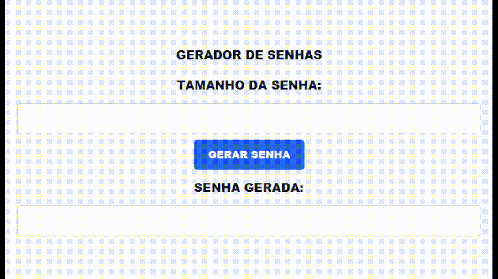

# Front-end para Gerador de Senhas Seguras

Interface gráfica em JavaFX para gerar senhas seguras usando a lógica criada no projeto anterior.



## Repositório

[frontend-gerador-senhas-seguras](https://github.com/p-rcorreia/frontend-gerador-senhas-seguras.git)

## Objetivo

Adicionar uma interface gráfica ao gerador de senhas seguras, reutilizando o método estático `GeradorDeSenhas.gerarSenha(int comprimento)`.

## Conceitos praticados

- JavaFX
- Java package
- Reutilização de regra de negócio
- Método estático
- `TextField` para entrada e saída de dados
- Campo de senha gerada não editável
- Evento de botão com `setOnAction`
- Layout com `VBox`
- Espaçamento com `Insets`
- Estilização com arquivo CSS
- Integração entre interface gráfica e lógica de segurança com `SecureRandom`

## Funcionalidades

- Campo para informar o tamanho da senha
- Botão para gerar senha
- Exibição da senha gerada em um `TextField`
- Campo de resultado bloqueado para edição manual
- Visual customizado com CSS

## Estrutura

```txt
geradorDeSenhas/
  FrontGeradorDeSenhas.java
  GeradorDeSenhas.java
  style.css
assets/
  gui-gerador-de-senhas.gif
```

## Como executar

No PowerShell, a partir da pasta do projeto:

```powershell
javac --module-path "$env:PATH_TO_FX" --add-modules javafx.controls .\geradorDeSenhas\*.java
java --module-path "$env:PATH_TO_FX" --add-modules javafx.controls geradorDeSenhas.FrontGeradorDeSenhas
```

## Aprendizado principal

Este projeto mostrou como uma regra de negócio pode ser reaproveitada em outra interface. A geração da senha ficou isolada na classe `GeradorDeSenhas`, enquanto a classe `FrontGeradorDeSenhas` ficou responsável pela tela, pelos controles e pela interação com o usuário.

## Status

Concluído.
